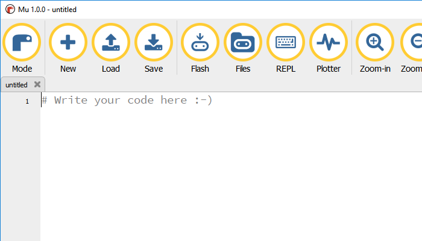
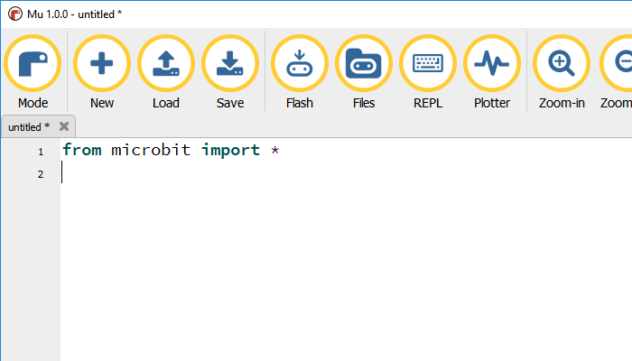
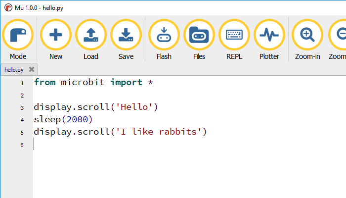
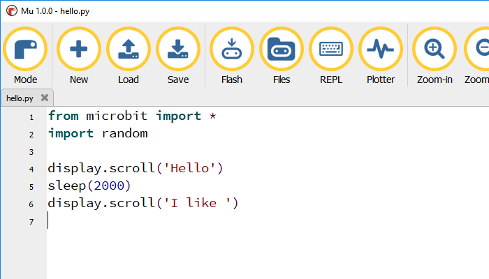
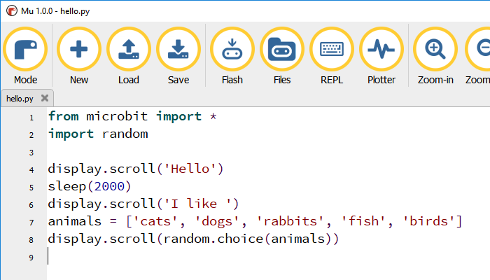

# MicroPython for micro:bit

## 1. Meet the micro:bit

This is the micro:bit – a small but powerful computer. It has an LED display, two buttons you can use to control your programs, pins to connect to other hardware, and lots of other cool features.

You are going to program the micro:bit using the MicroPython language – you’ve guessed it, MicroPython is a version of Python designed for small computers.

You will use a PC program called Mu to write your code, then “flash” it onto the micro:bit through a USB cable.

## 2. Your first MicroPython program

Open the Mu editor and click the **New** button to create a new program file. Make sure you can see this.

Python is a high level programming language: that just means that it uses words that are like the English language we humans use. 

Each line in a Python program is run in sequence – like a stack of Scratch blocks, the program runs from top to bottom.

**Line 1** in this program reads in the special code needed to handle the micro:bit’s display, buttons and other features.

**Line 3** starts with the `#` (hash) character. This makes it a comment – it explains something to humans reading the program but does not actually do anything.

So you should add some code to the program! First, save the file with a name you will remember. Save the file every few minutes as you work through the project.

## 3. Say “hello”

Delete the comment and add this line of Python code.

Make sure the mico:bit and USB cable are connected to the PC. Now click on the **Flash** button on the Mu editor toolbar. Look at the back of the micro:bit – can you see a yellow LED flashing?

When the flashing stops, look at the front of the micro:bit. You should see “hello” scroll across the display. If you see a different message, ask your mentor for help.

If you want to run the program again, press the reset button on the back of the micro:bit.

## 4. Say some more

Add two more lines of code to your program, to make it a bit more talkative.

The `sleep()` command stops the program for the number of miilseconds that you put between the brackets.

There are one thousand milliseconds in a second, so can you work out how long `sleep(2000)` will wait for?

Save your program, flash it to the micro:bit and see what you get on the display.

## 5. Which animal do you like?

At the moment, the program always says the same thing – it only likes rabbits. You can add code to make it choose a different animal at random each time you run the program.

First, make two small changes to the program. Can you see what has changed?

The new **line 2** brings in some more useful code that will let you pick items from a list at random.

To choose an animal at random, add two more lines of code to the program.

**Line 7** creates a list of words and names the list `animals`. Lists are an important part of Python – they begin and end with square brackets, and the items in the list have commas to separate them.

**Line 8** uses that `random` code that you imported to choose one of the items from the `animals` list.

Save your program, flash it to the micro:bit and see what you get on the display. Press the reset button to run the program a few times – what animals’ names do you see?

## 6. Congratulations

You have written your first MicroPython program, used a Python list and displayed words on the micro:bit LEDs.

Here are a couple of ideas for follow-up experiments.

1.  Try this new version of **line 8** (keep the rest of the program the same). What effect does it have on the display? Try different numbers instead of 50.
  
    
    
2.  Change the program so that it displays random football teams instead of animals.

