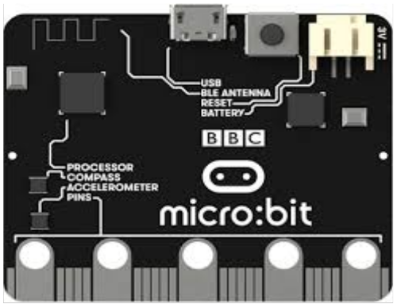
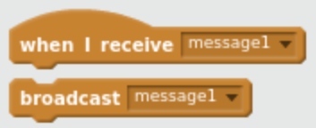

# RADIO MESSAGES


## 1. About the micro:bit radio

The processor chip used in the micro:bit has a built-in radio transmitter and receiver.  It can send and receive data in the 2.4GHz frequency band (the same frequency as WiFi and Bluetooth). If you look closely, you can see the radio antenna on the PCB (the wiggly line of copper above the processor).




In MicroPython, you can use the radio to send and receive strings of characters between micro:bits.  You decide what messages to send and what they mean.  This is like messages in Scratch, although those messages are sent between sprites in the same program.




---
**To get started with radio, we want one person to program their micro:bit as a beacon that broadcasts messages. Everyone else programs their micro:bits to receive the messages. Decide which you are going to be, then jump to section 2 or section 3.**

---


## 2. Beacon

Open the Mu editor and create a new program.  Type a comment to explain what the program does, then add the import statements to include the micro:bit and radio functions we need.

```python
# Radio beacon for micro:bit

from microbit import display, Image, sleep
import radio
```

The beacon will send out a message every few seconds.  You need to say what the message is and how often it is sent, so add these lines to your program.

```python
MESSAGE = "dojo"
INTERVAL = 5
```

You can choose your own message, but keep it short.  The `INTERVAL` is the number of seconds between sending messages.  Don’t make it too quick – 5 is a good number.

[TBC]

```python
OUR_GROUP = 42 # ask your mentor what group number to use
```

Because you can’t see radio messages, add a statement to show something on the micro:bit display, just so you know that the program is running.

```python
display.show(Image.YES)
```

> Download the program to the micro:bit now; you should see a tick mark on the display.

Next, add the code to broadcast the message.  Start by configuring the radio to only broadcast to our group of micro:bits and then turn the radio on.

```python
radio.config(group=OUR_GROUP)
radio.on()
```

Now add a loop that sends the message and sleeps before repeating.

```python
while True:
    radio.send(MESSAGE)
    sleep(INTERVAL * 1000)
```

> Download the program to the micro:bit again and make sure you can still see the tick mark on the display.

---
**Find someone with the receiver program so you can test the beacon.**

---


## 3. Receiver

Open the Mu editor and create a new program.  Type a comment to explain what the program does, then add the import statements to include the micro:bit and radio functions we need.

```python
# Radio receiver for micro:bit

from microbit import display, Image, sleep
import radio
```

[TBC]

```python
OUR_GROUP = 42 # ask your mentor what group number to use
```

So that you know the program is running, add a statement to show something on the micro:bit display.

```python
display.show(Image.SQUARE_SMALL)
```

> Download the program to the micro:bit now; you should see a square on the display.

Now add the code to receive and display messages. Start by configuring the radio to only receive from our group of micro:bits and then turn the radio on.

```python
radio.config(group=OUR_GROUP)
radio.on()
```

Now add a loop that checks if a message has been received and scrolls it if it has.

```python
while True:
    message = radio.receive()
    if message:
        display.scroll(message, delay=50)
        display.show(Image.SQUARE_SMALL)
```


> Download the program to the micro:bit again and make sure you can still see the square on the display.

---
**Find someone with the beacon program so you can test the receiver.**

---


