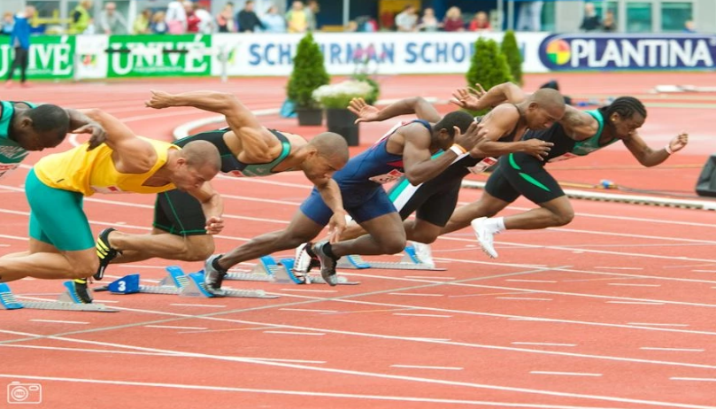

# RADIO REACTION GAME


## 1. About the game

The game uses the micro:bit radio to see which player can react the quickest.

One person is the referee.  Their micro:bit controls the game. The other people are players.  Their micro:bits listen out for a radio message from the referee to start the game.

When they receive the message, the players’ micro:bits change the image on the display.  When they see this, all the players try to press their Button A as quickly as possible.

As soon as Button A is pressed, the player’s micro:bit sends out a radio message with the player’s name.

The referee’s micro:bit listens out for these messages.  The winner is the first message received.  The winner’s name is shown on the referee’s display and sent out as a radio message to the player’s micro:bits, which also show the winner’s name.

Then the referee can start a new game.




---
**We want one person to program their micro:bit as the referee that controls the game. Everyone else programs their micro:bits to play the game. Decide which you are going to be, then jump to section 2 or section 3.**

---


## 2. Referee

Open the editor and create a new program. Type a comment to explain what the program does, then add the `import` statements to include the micro:bit and radio functions we need.

```python
# Radio reaction time game - referee

from microbit import display, Image, button_a
import radio
```

The referee sends out two types of radio messages: a “go” message to start each game, and a “winner” message with the name of the player who reacts first. Add these lines to your program to define what these messages will be.  Also add a constant to control how fast messages scroll on the display; the smaller the number the faster the scroll.

```python
GO_MESSAGE = "go"
WINNER_PREFIX = "winner: "
SCROLL_SPEED = 50
```

[TBC]

```python
OUR_GROUP = 73 # ask your mentor what group number to use
```

Now add code to configure the radio to only broadcast to our group of micro:bits and then turn the radio on.

```python
radio.config(group=OUR_GROUP)
radio.on()
```

Then add code to display a message and icon.  The icon tells the referee that they can press Button A when they want to start the game.

```python
display.scroll("referee ready", SCROLL_SPEED)
display.show(Image.TARGET)
```

Now add a `while` loop that will loop forever.  Each time round the loop is one round of the game.

```python
while True:
```

At the start of each game, the program must wait for the referee to press Button A.  Add this `while` loop to keep checking if the button has been pressed.  The code inside the loop receives and throws away any old radio messages that happen to be received, so that they don’t interfere with the game.

```python
    while not button_a.was_pressed():
        message = radio.receive()
```

When Button A is pressed, the program broadcasts the “go” message and changes the display, so the referee knows that the game is working.  Add this code.  Be careful to indent it correctly.

```python
    radio.send(GO_MESSAGE)
    display.show(Image.CONFUSED)
```

Now the program needs to listen out for any received radio messages.  Add this code.

```python
    message = radio.receive()
    while message is None:
        message = radio.receive()
```

This `while` loop ends and the program continues as soon as the first message is received. 

The message will contain the player’s name, so add this code to broadcast the winner to all the players and scroll it on the display.  The last line of code changes the display back to the icon, so the referee knows they can start another round when they want to.

```python
    radio.send(WINNER_PREFIX + message)
    display.scroll(WINNER_PREFIX + message, SCROLL_SPEED)
    display.show(Image.TARGET)
```

> Download the program to the micro:bit now to make sure there are no errors.


---
**Find someone with the player program so you can test your referee program.**

---


## 3. Player

Open the editor and create a new program. Type a comment to explain what the program does, then add the import statements to include the micro:bit and radio functions we need.

```python
# Radio reaction time game - referee

from microbit import display, Image, button_a
import radio
```

The referee sends out two types of radio messages: a “go” message to start each game, and a “winner” message with the name of the player who reacts first. Add these lines to your program to define what these messages will be.  Also add a constant to control how fast messages scroll on the display; the smaller the number the faster the scroll.

```python
GO_MESSAGE = "go"
WINNER_PREFIX = "winner: "
SCROLL_SPEED = 50
```

[TBC]

```python
OUR_GROUP = 73 # ask your mentor what group number to use
```

The player program sends out a radio message with your name, so add this line to your code but use your own name.  If two of you have the same name, you will have to agree what name each of you uses.

```python
MY_NAME = "Gita"
```

In case you get bored and don’t press the button during a game, the program will automatically reset after a timeout period.  Add this line of code to set the timeout.  The number is in milliseconds, so 3000 will make the timeout three seconds.

```python
TIMEOUT = 3000
```

Next, define a function to do the main job of measuring how quickly you react.  The code changes the display icon to a tick and waits for one of two things to happen: either you press Button A or the timeout runs out.  If you pressed the button before the timeout, the function broadcasts a message with your name for the referee to receive.  Either way, the function changes the display back to a cross icon ready for the next game.

```python
def measure_reaction_time():
    display.show(Image.YES)
    start_time = running_time()
    while (not button_a.is_pressed()) and (running_time() - start_time < TIMEOUT):
        pass
    if running_time() - start_time < TIMEOUT:
        radio.send(MY_NAME)
    display.show(Image.NO)
```

Now you can start on the main part of the program.  Add code to configure the radio to only broadcast to our group of micro:bits and then turn the radio on.

```python
radio.config(group=OUR_GROUP)
radio.on()
```

Add more code to display a message and the cross icon. The icon tells the player to wait for the tick icon before they can press Button A.

```python
display.scroll("player ready", SCROLL_SPEED)
display.show(Image.NO)
```

> Download the program to the micro:bit now; you should see the message and the icon on the display.

Now add a `while` loop that will loop forever and code to receive a radio message.

```python
while True:
    message = str(radio.receive())
```

The micro:bit radio will pick up all messages broadcast by any micro:bits that are in range.  That includes the messages sent by other players.  But we are only interested in messages from the referee.  Add this code to check for the “go” message and the “winner” message. Be careful to indent it correctly.

```python
    if message is GO_MESSAGE:
        measure_reaction_time()
    elif message.startswith(WINNER_PREFIX):
        display.scroll(message, SCROLL_SPEED)
        display.show(Image.NO)
    else:
        pass
```

The keyword `pass` is Python for “do nothing”.  If the radio message is neither the “go” message nor the “winner” message, we ignore it and wait for the next message. 

> Download the program to the micro:bit now to make sure there are no errors.

---
**Find someone with the referee program so you can test the player program. It is best to test one player at a time with the referee before competing with other players. Make sure that all the player names are different.**

--


